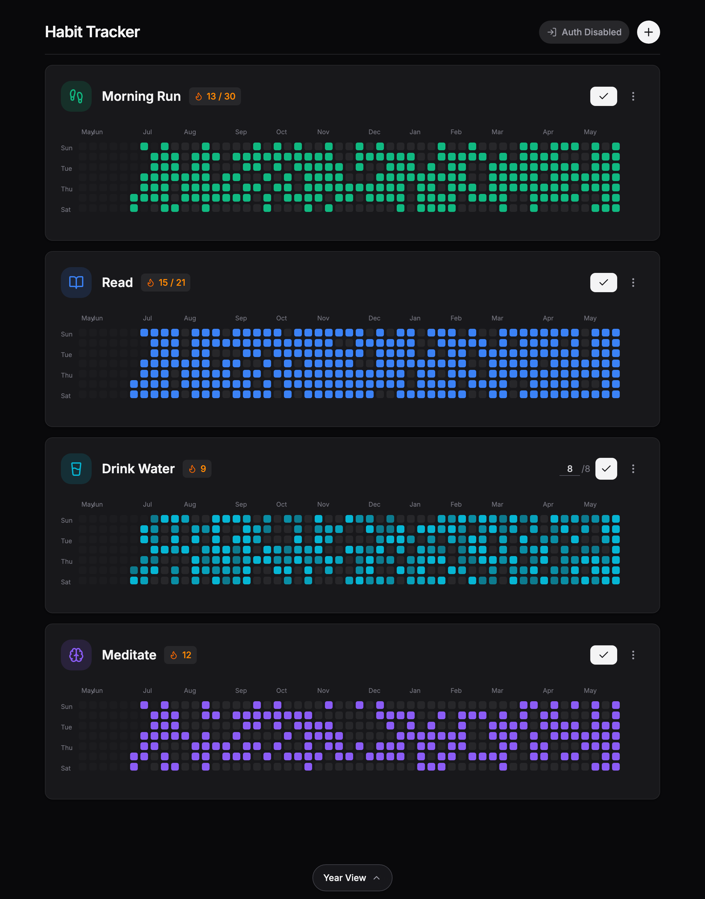
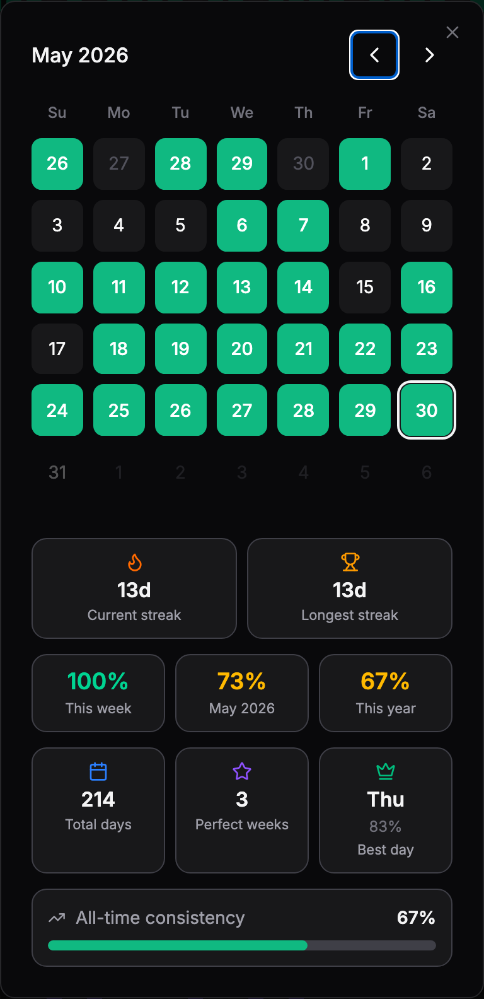
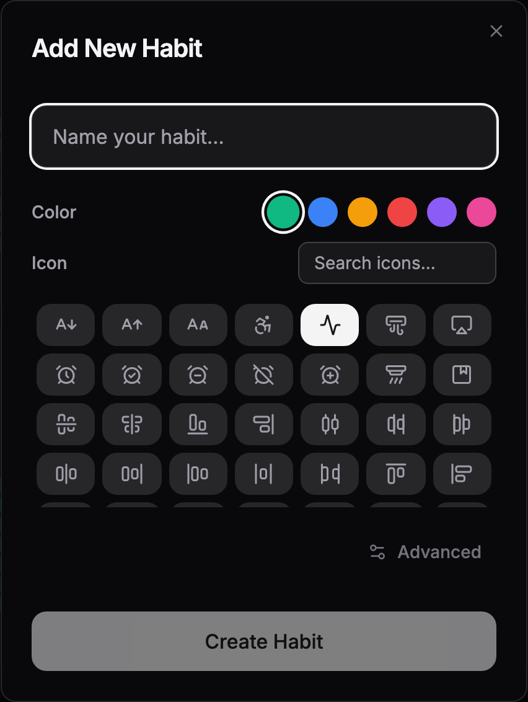
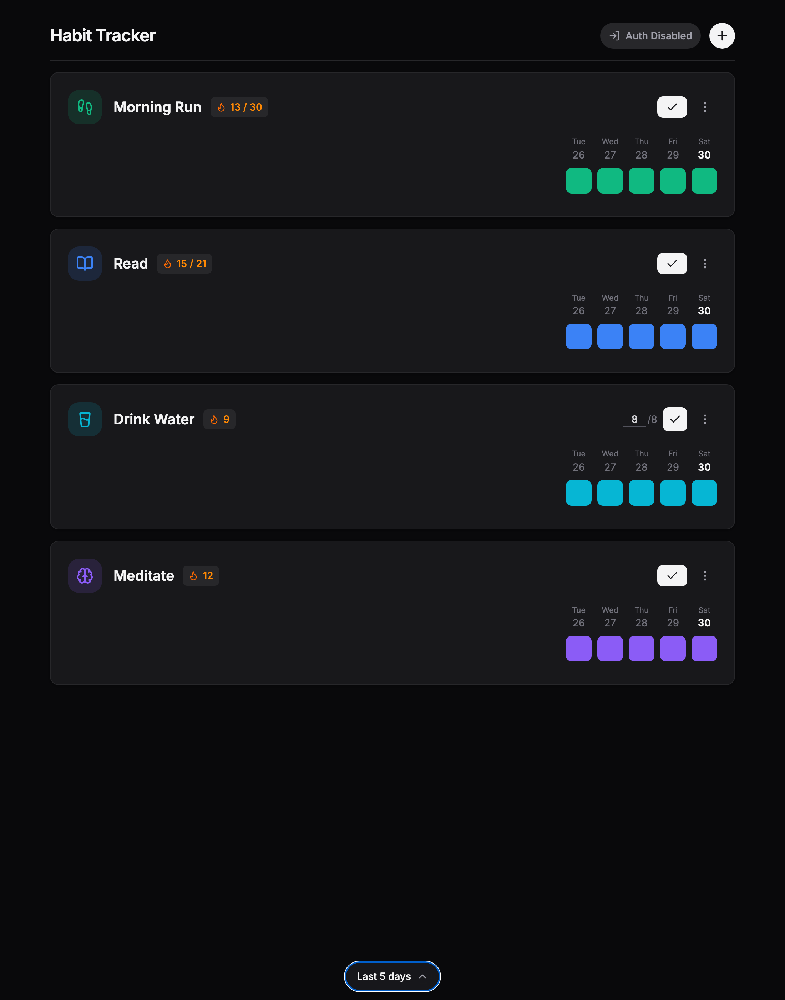
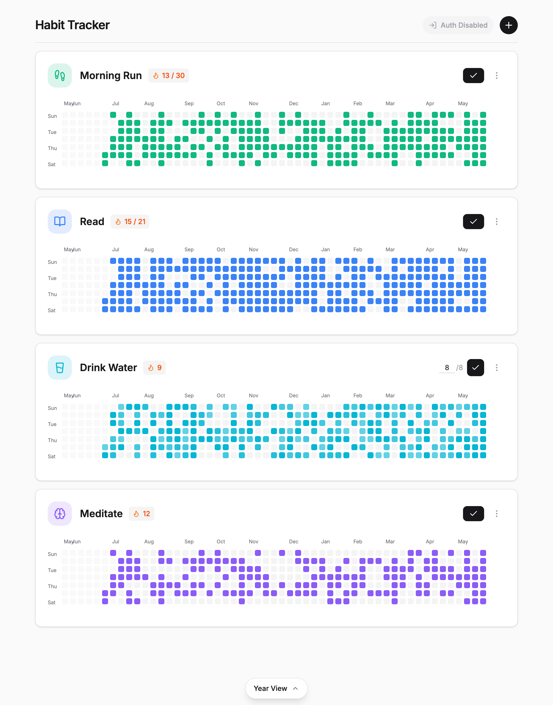

# Habitool

A fast, local-first habit tracker. Build streaks, log daily progress, and watch a
GitHub-style contribution graph fill in for every habit. Works fully offline in the
browser, installs as a native Android/iOS app, and optionally syncs across devices
with Google sign-in.

- **Local-first** — your habits live in the browser/device and work with zero setup or network.
- **Optional cloud sync** — sign in with Google to back up and sync across devices (powered by [Convex](https://convex.dev)).
- **Cross-platform** — one React codebase ships to web (GitHub Pages) and native mobile via [Capacitor](https://capacitorjs.com).
- **Light & dark** — follows your system theme automatically.

---

## Screenshots

| Year contribution graph | Calendar & stats |
| --- | --- |
|  |  |

| Add a habit | Recent-days view |
| --- | --- |
|  |  |

Light theme is supported too (the app follows your system setting):

> Regenerate these images any time with `node scripts/capture-screenshots.mjs` while the dev server is running (see [Regenerating screenshots](#regenerating-screenshots)).

---

## Features

- **Daily check-off** — tap to mark a habit done for today. Hit the same button again to undo.
- **Measurable habits** — set a daily target (e.g. "Drink water · 8 glasses") and log a count toward it instead of a simple yes/no.
- **Streaks & streak goals** — a flame badge tracks your current streak; set an optional goal (e.g. `15 / 30`) to chase.
- **Contribution graph** — a full year of activity per habit, color-coded to the habit's color (like GitHub's commit graph).
- **Recent-days view** — switch to a compact "Last 2–7 days" layout from the floating view selector at the bottom.
- **Calendar & statistics** — tap any habit to open a month calendar plus stats: current/longest streak, week/month/year completion rate, total days, perfect weeks, and your best day of the week.
- **Backfill & edit history** — toggle or set a value on any past date directly from the calendar or graph.
- **Custom color & icon** — pick from a palette and search hundreds of [Lucide](https://lucide.dev) icons per habit.
- **Offline-friendly sync** — when signed in, taps are buffered and replayed once the connection/session is restored, so the UI never blocks on "Checking session…".

## How to use

1. **Add a habit** — click the **+** in the top-right. Give it a name, pick a color and icon, then **Create Habit**.
   - Click **Advanced** to set a **Daily Target** (makes it a measurable/count habit) and/or a **Streak Goal**.
2. **Log progress** — on each habit card:
   - **Yes/no habits:** click the ✓ button to mark today complete (click again to undo).
   - **Measurable habits:** type a number into the `n / target` field, or click ✓ to fill the target instantly.
3. **Switch views** — use the floating pill at the bottom to toggle between the **Year** contribution graph and a **Last X days** view.
4. **Edit history** — tap a cell in the graph (or open the calendar) to mark/unmark any past day.
5. **See your stats** — click a habit card to open its calendar and statistics for the selected month.
6. **Edit or delete** — use the **⋮** menu on a habit card.
7. **Sync (optional)** — click **Sign in** and authenticate with Google to back up and sync your habits across devices. Without sign-in, everything stays on the device.

> **Local-only mode:** if no `VITE_CONVEX_URL` is configured, the app still runs fully — it just hides sign-in and keeps all data in local storage.

---

## How it works

- **Frontend:** React 19 + Vite + Tailwind CSS v4, with [Lucide](https://lucide.dev) icons and [Motion](https://motion.dev) for animation.
- **Storage:** habits and logs are persisted in `localStorage` (`habits` / `habitLogs` keys), with an in-memory fallback when storage is unavailable.
- **Sync:** [Convex](https://convex.dev) holds `habits` and `logs` tables keyed by user. A hybrid provider serves cached cloud data instantly on launch and buffers/replays edits across the auth handshake (`src/hooks/HabitContext.tsx`).
- **Auth:** Google sign-in via [`@convex-dev/auth`](https://labs.convex.dev/auth). Web uses a standard OAuth redirect; native apps use the system browser + a deep link (`habitool://auth`).
- **Access control:** a DB-backed email allowlist is enforced in Convex before a session is created (see [Email Allowlist](#email-allowlist-db-backed)).
- **Mobile:** [Capacitor](https://capacitorjs.com) wraps the web build into native Android/iOS shells.

---

## Prerequisites

- Node.js 20+
- Convex account/project (only needed for cloud sync — the app runs locally without one)

## Run Locally

1. Install dependencies:
   `npm install`
2. Set frontend env in `.env.local`:
   `VITE_CONVEX_URL="https://<your-dev-deployment>.convex.cloud"`
   (omit this to run in local-only mode without sign-in)
3. Start Convex dev (in a separate terminal):
   `npx convex dev`
4. Run the app:
   `npm run dev`

The app runs at `http://localhost:3000/Habitool/`.

### Tests

- Unit tests (Vitest): `npm test`
- End-to-end tests (Playwright, local-only mode): `npm run test:e2e`
- Type-check: `npm run lint`

## Convex Auth Environment (Backend)

Set these in Convex deployment settings (dev and prod as needed):
- `SITE_URL` (your web app origin, e.g. `https://<user>.github.io/<repo>`)
- `AUTH_GOOGLE_ID`
- `AUTH_GOOGLE_SECRET`

If Google sign-in redirects to `localhost` in production, check your Convex **production** environment values:
- `SITE_URL` must be your live web origin (not `http://localhost:3000`)
- `APP_URL` can also be set as a fallback origin

## Mobile App (Capacitor)

This project is configured with Capacitor.

1. Build and sync native projects:
   `npm run cap:sync`
2. Android:
   `npm run android:run:debug`
3. iOS (macOS + Xcode):
   `npm run cap:open:ios`

### Use Convex Prod in Mobile Builds

Use the `:prod` scripts so mobile bundles point to Convex production:

- Sync both platforms with prod URL:
  `npm run cap:sync:prod`
- Android with prod URL:
  `npm run cap:android:prod`
- iOS with prod URL:
  `npm run cap:ios:prod`

Current prod URL baked by these scripts:
`https://accurate-aardvark-130.convex.cloud`

Important: use `cap:*` scripts (or `build:mobile*`) for mobile builds. They force `VITE_BASE_PATH=./` so Android/iOS WebView can load bundled assets correctly.

### Android CLI (No Android Studio)

Requires JDK 21 (preferred) or JDK 17. JDK 25 is not supported by this Gradle stack.

1. Check device:
   `npm run android:devices`
2. Build debug APK:
   `npm run android:build:debug`
3. Install APK:
   `npm run android:install:debug`
4. Launch app:
   `npm run android:launch`

Debug APK path:
`android/app/build/outputs/apk/debug/app-debug.apk`

### Android Studio (Optional)

`npm run cap:open:android`

## Deploy Web App (GitHub Pages)

This repo deploys via `.github/workflows/deploy-pages.yml` on push to `main`.

Required GitHub configuration:
1. In `Settings -> Environments -> github-pages -> Secrets`, set:
   `VITE_CONVEX_URL=https://<your-prod-deployment>.convex.cloud`
2. Ensure Pages is configured to use GitHub Actions.
3. Push to `main` (or run the workflow manually).

Note: no GitHub Actions workflow changes are required for Capacitor mobile builds. Mobile builds use your local `npm run cap:*` commands.

## Email Allowlist (DB-backed)

Allowlist is enforced in Convex before session creation.

Deploy backend changes to prod:
`npx convex deploy -y`

List:
- Dev: `npm run allowlist:list:dev`
- Prod: `npm run allowlist:list:prod`

Grant access:
- Dev: `npm run allowlist:grant:dev -- '{"email":"user@example.com","role":"user"}'`
- Prod: `npm run allowlist:grant:prod -- '{"email":"user@example.com","role":"user"}'`

Promote/demote role:
- Dev: `npm run allowlist:role:dev -- '{"email":"user@example.com","role":"admin"}'`
- Prod: `npm run allowlist:role:prod -- '{"email":"user@example.com","role":"admin"}'`

Revoke access:
- Dev: `npm run allowlist:revoke:dev -- '{"email":"user@example.com"}'`
- Prod: `npm run allowlist:revoke:prod -- '{"email":"user@example.com"}'`

Bootstrap first admin in prod:
`npm run allowlist:grant:prod -- '{"email":"you@example.com","role":"admin"}'`

## Regenerating screenshots

The images in `docs/screenshots/` are generated by `scripts/capture-screenshots.mjs`,
which seeds a year of demo data and captures each view with Playwright:

1. Start the dev server in local-only mode: `VITE_CONVEX_URL= npm run dev`
2. In another terminal: `node scripts/capture-screenshots.mjs`

## Notes

- Web app uses Google sign-in with Convex.
- Android app supports Google sign-in via system browser + deep link (`habitool://auth`) for Convex sync.
